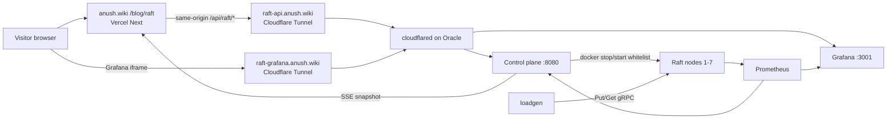

# kill-my-cluster

Custom Raft KV with a public proof: **seven machines**, kill one, watch election and
catch-up. Public UI: [anush.wiki/blog/raft](https://anush.wiki/blog/raft)
(**come kill my cluster!**). No `demo.anush.wiki`.

## How the system runs



| Layer | Role |
|-------|------|
| Wiki HUD | Kill buttons, live SSE (users, uptime, writes/s, reads/s, machines) |
| Control plane | Whitelist Docker actions only; kill budget; silent auto-recover |
| Raft + KV | 7-node quorum (need 4); Gets still go through the Raft log |
| Loadgen | Steady background Put/Get (kept modest so leaders stay stable) |
| Grafana | Embed at `raft-grafana.anush.wiki` |

### Crowd-control defaults (control plane)

| Rule | Value |
|------|--------|
| Per-IP kill cooldown | **2s** (same computer / IP) |
| Public reset | **off** |
| Recover delay | internal only (not advertised on the wiki) |

Leaders should flip when a visitor kills a machine, not under idle load.

## Status

- Phases 1-4 (storage, Raft, KV, observability) done
- Docker 7-node compose + loadgen + CP done
- Public path: wiki → Cloudflare Tunnel → Oracle CP
- Hosting notes: `migration_anush_wiki.md`, `deploy/oracle/README.md`

## Layout

```
internal/storage/      WAL + durable storage
internal/raft/         Raft consensus
internal/kv/           replicated KV + remote Client
internal/metrics/      Prometheus collectors (Raft / apply / writes / reads)
internal/controlplane/ kill / partition / restart + SSE + presence/QPS
cmd/node/              Docker node entrypoint
cmd/loadgen/           sustained Put/Get traffic
cmd/controlplane/      whitelist kill switch
cmd/*demo/             phase demos (storage / raft / kv / metrics)
deploy/observability/  Prometheus + Grafana only (host scrape)
deploy/compose/        Full stack: 7 nodes + Prom/Grafana/CP/web/loadgen
web/                   SvelteKit local demo UI (Threlte 3D); public UI is the wiki
```

## Requirements

- Go 1.22+ (developed on 1.26).
- **Phase 2+:** `protoc` + `protoc-gen-go` + `protoc-gen-go-grpc` (for regenerating protos).
- **Docker:** Docker + Docker Compose.
- **Web (local hot reload):** Node 20+.

## Running

```bash
go test ./...
```

```bash
go run ./cmd/storagedemo
go run ./cmd/raftdemo
go run ./cmd/kvdemo
```

### Host metricsdemo + observability compose

```bash
cd deploy/observability && docker compose up -d
go run ./cmd/metricsdemo
# Grafana http://localhost:3001  (admin/admin)
```

### Docker cluster (preferred)

```bash
cd deploy/compose
docker compose up -d --build
# Oracle VM overlay (no local Svelte web, Prometheus unpublished):
# docker compose -f docker-compose.yml -f docker-compose.oracle.yml up -d --build
```

| Service        | URL                              | Notes                                      |
|----------------|----------------------------------|--------------------------------------------|
| Public UI      | anush.wiki/blog/raft             | Wiki HUD + kill (proxies `/api/raft`)      |
| Local web      | http://localhost:5173            | Optional Threlte UI                        |
| Control plane  | http://localhost:8080            | Kill / partition / restart · SSE           |
| Grafana local  | http://localhost:3001            | `admin` / `admin`                          |
| Grafana public | https://raft-grafana.anush.wiki  | Tunnel hostname (embed on wiki)            |
| Prometheus     | http://localhost:9090            | Scrapes machine metrics (not public)       |
| Loadgen        | (compose service)                | Modest QPS so the leader stays stable      |

**7-machine** Raft group (quorum 4). Public reset is disabled (`ALLOW_RESET=false`).

```bash
curl -X POST http://localhost:8080/api/nodes/1/kill
curl -X POST http://localhost:8080/api/nodes/2/partition
curl -X POST http://localhost:8080/api/reset   # 403 when ALLOW_RESET=false
docker compose down
```

## Next: security hardening (after demo polish)

Track in `migration_anush_wiki.md`. Intended follow-ups:

1. OCI: confirm only SSH is public; app ports closed
2. Cloudflare WAF / rate limit on kill POST (loose complement to CP)
3. Tunnel ingress restricted to `/api/*` + `/healthz` (and Grafana path if kept)
4. Rotate tunnel token if it ever landed in chat/logs
5. Optional: separate Grafana credentials; drop anonymous admin on public embed
6. Document incident steps (revoke tunnel, freeze compose)
