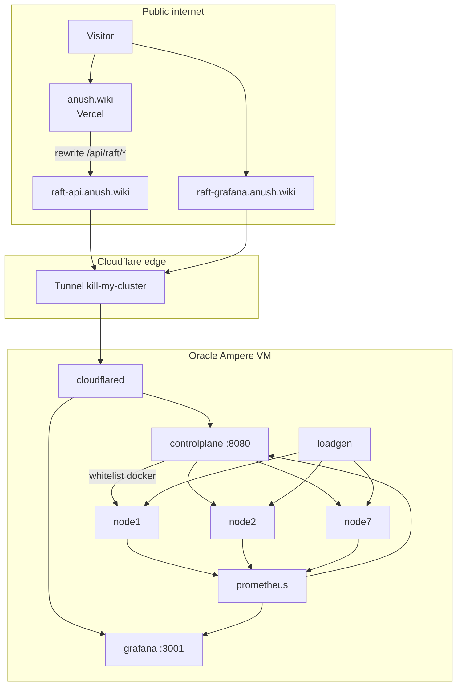

# Migration: kill-my-cluster backend → anush.wiki/blog/raft

Public UI stays on **anush.wiki/blog/raft**. This repo is the Go cluster + control plane on Oracle.
No `demo.anush.wiki` product URL.

**Status (2026-07-20):** Oracle Ampere VM running compose. Cloudflare Tunnel `kill-my-cluster` healthy.
`raft-api.anush.wiki` → CP `:8080`. Vercel `RAFT_CP_URL=https://raft-api.anush.wiki`.
Grafana public hostname: `raft-grafana.anush.wiki` → `:3001` (add tunnel route if missing).

---

## Technical write-up

### What visitors see

The wiki page embeds a live HUD. The browser opens an SSE stream to same-origin
`/api/raft/stream` and posts kills to `/api/raft/nodes/{id}/kill`. Next.js on Vercel
rewrites those paths to the Cloudflare hostname for the control plane. Visitors never
talk to the Oracle public IP.

### What runs on Oracle

- **7 Raft+KV nodes** (Docker): election, log replication, WAL, exactly-once sessions
- **loadgen**: background Put/Get so writes/s and reads/s move (QPS kept modest)
- **control plane**: whitelist `docker stop/start` + network partition; SSE snapshots;
  Prom-backed QPS; crowd limits
- **Prometheus + Grafana**: scrape node metrics; Grafana embeddable on the wiki
- **cloudflared**: outbound-only Tunnel to Cloudflare (no need to publish `:8080`)

### Crowd control (v1)

| Rule | Value | Why |
|------|--------|-----|
| Per-IP kill cooldown | 2s | Same computer cannot spam kills |
| Silent recover | internal delay | UI does not advertise the timer |
| Reset | disabled publicly | Avoid wipe / grief |

### Architecture diagram



### Request paths

| Client call | Becomes |
|-------------|---------|
| `GET /api/raft/stream` | `GET https://raft-api.anush.wiki/api/stream` |
| `POST /api/raft/nodes/3/kill` | `POST https://raft-api.anush.wiki/api/nodes/3/kill` |
| Grafana iframe | `https://raft-grafana.anush.wiki/d/kmc-overview/...` |

SSH to the VM (ops only): `ssh -i ~/.ssh/id_ed25519 ubuntu@137.131.28.40`

---

## Information needed before implementing Cloudflare

Filled for the current cutover:

| # | Question | Answer |
|---|----------|--------|
| 1 | Cloudflare account | owns `anush.wiki` (DNS Full) |
| 2 | DNS on Cloudflare? | yes (apex → Vercel, proxied) |
| 3 | CP hostname | `raft-api.anush.wiki` |
| 4 | Grafana hostname | `raft-grafana.anush.wiki` |
| 5 | SSH | `ubuntu@137.131.28.40` (`~/.ssh/id_ed25519`) |
| 6 | OS / arch | Ubuntu 24.04 aarch64, A1 Flex 4 OCPU / 24 GB |
| 7 | cloudflared systemd | installed, active |
| 8 | OCI :8080 public? | timed out from laptop (keep closed) |
| 9 | Edge | Tunnel (not orange-cloud to VM IP) |
| 10 | Tunnel name | `kill-my-cluster` |
| 11 | Auth | install token on VM (do not commit) |
| 12 | Access policy | public (no CF Access) |
| 13 | Vercel project | anush-wiki / anush.wiki |
| 14 | `RAFT_CP_URL` | `https://raft-api.anush.wiki` (Production) |
| 15 | Local override | `.env.local` → `http://127.0.0.1:8080` |

---

## Cloudflare plan (implementation)

### Locked choices

| Topic | Choice |
|-------|--------|
| Edge | Cloudflare Tunnel (`cloudflared` on the VM) |
| CP hostname | `raft-api.anush.wiki` |
| Grafana hostname | `raft-grafana.anush.wiki` |
| Product URL | `anush.wiki/blog/raft` only |
| Wiki → CP | Vercel `RAFT_CP_URL=https://raft-api.anush.wiki` |
| Kill limits | control plane (2s per IP only) |
| OCI after cutover | deny public app ports; SSH only |
| Heal messaging | not advertised on the public wiki |

### Published routes

| Public hostname | Service (VM) |
|-----------------|--------------|
| `raft-api.anush.wiki` | `http://127.0.0.1:8080` |
| `raft-grafana.anush.wiki` | `http://127.0.0.1:3001` |

If Grafana still 404s from the internet: Zero Trust → tunnel `kill-my-cluster` →
**Published application routes** → add the Grafana hostname as above.

### Deploy / verify

```bash
cd deploy/compose
docker compose -f docker-compose.yml -f docker-compose.oracle.yml up -d --build
curl -sS http://127.0.0.1:8080/healthz
curl -sS https://raft-api.anush.wiki/healthz
curl -sS -N -m 3 https://raft-api.anush.wiki/api/stream | head
```

Smoke wiki: open `https://anush.wiki/blog/raft`, confirm stable leader, kill once,
confirm cooldown errors on spam, confirm Grafana iframe loads.

---

## Design defaults (product v1)

| Topic | Default |
|-------|---------|
| Public actions | Kill only (reset disabled) |
| Recover | silent internal heal (do not publish the delay) |
| Presence | Open SSE connections |
| HUD | users, uptime, writes/s, reads/s, machines + kill |
| Loadgen | modest QPS (compose: ~80 writes/s, ~160 reads/s targets) |
| Raft timeouts | ~750-1500ms election (stable under Docker load) |
| Grafana | `raft-grafana.anush.wiki` embed |
| Wiki proxy | `/api/raft/:path*` → `$RAFT_CP_URL/api/:path*` |
| Edge | Cloudflare Tunnel |
| Kill limits | 2s per IP only |

---

## Next: harden with proper security measures

Do this after the demo UX is stable. Checklist:

1. **OCI network**
   - Confirm security list: SSH (22) from your IP only
   - No public ingress for `8080`, `3001`, `9090`, `7000`, `8000`, `9100`
2. **Tunnel ingress**
   - Restrict `raft-api` paths to `/api/*` and `/healthz` if CF UI allows cleanly
   - Keep Prometheus off the Tunnel entirely
3. **Cloudflare WAF**
   - Light rate limit on `POST .../api/nodes/*/kill` (above CP limits)
   - Leave Bot Fight off until SSE is proven under it
4. **Secrets hygiene**
   - Rotate tunnel token if it appeared in chat or shell history
   - Never commit tokens; document install in `deploy/oracle/cloudflared/` without secrets
5. **Grafana**
   - Decide: keep anonymous viewer embed vs password + tighter path
   - Confirm `GF_SECURITY_ALLOW_EMBEDDING` only as needed for `anush.wiki`
6. **Ops runbook**
   - How to revoke tunnel, `docker compose stop`, and freeze kills quickly
7. **Optional later**
   - Cloudflare Access only if the demo should stop being public
   - ReadIndex / cheaper Gets before raising loadgen toward 1.5k/10k again

---

## Out of scope

- Moving Raft into Next.js
- `demo.anush.wiki` branding
- Cloudflare Access login for visitors (v1)
- Exposing Prometheus publicly
